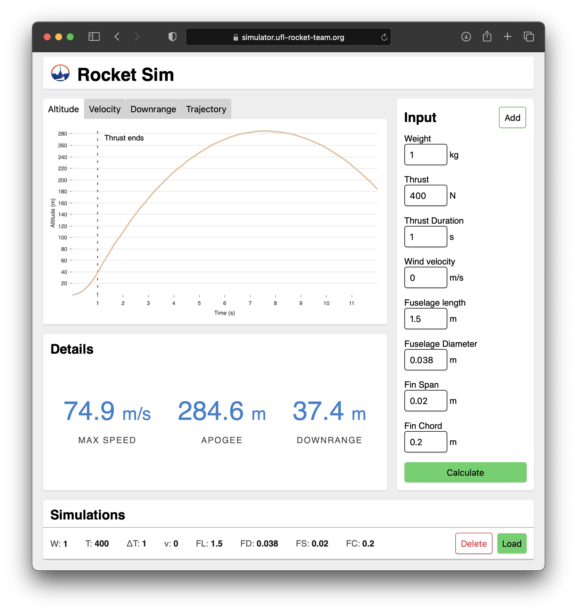

# ufrt-rocket-sim

An online simulation tool that can compute a rocket trajectory based on inputted parameters. It supports multiple data views and saving simulations for easy comparison. Built for the UF Rocket Team.

Live at [lucasgrinspan.github.io/ufrt-rocket-sim](https://lucasgrinspan.github.io/ufrt-rocket-sim) or [simulator.ufl-rocket-team.org](https://simulator.ufl-rocket-team.org).

